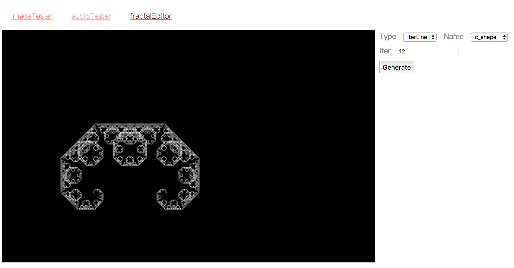
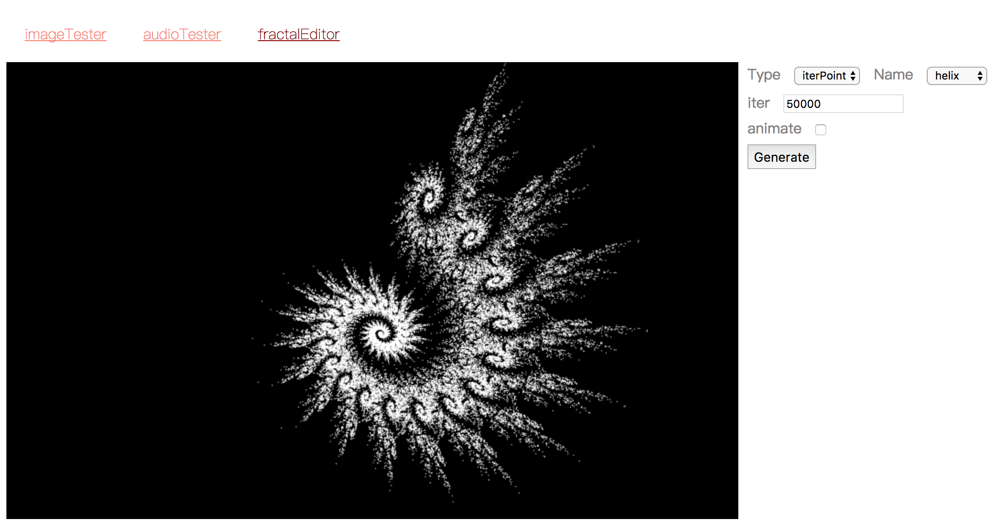
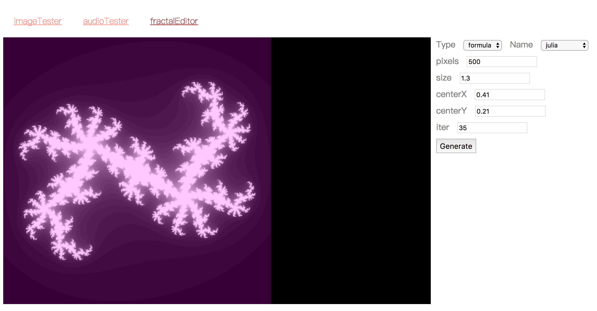
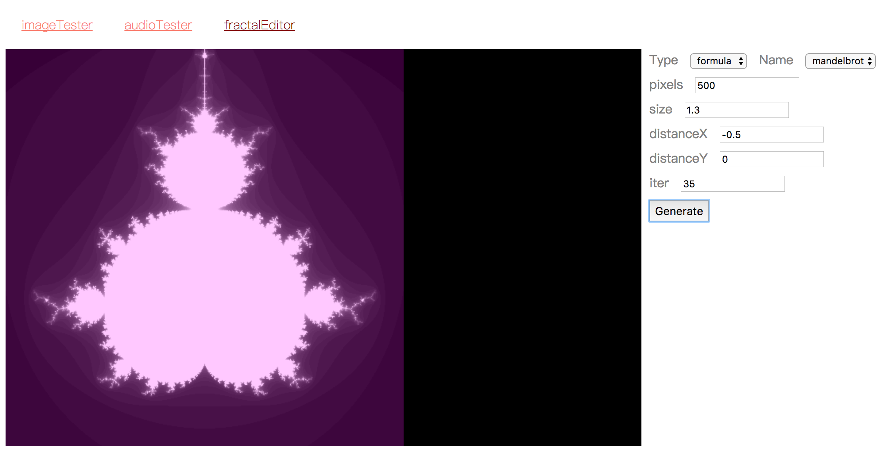

# fractal - js realizations

try https://walliychao.github.io "fractal Editor -> Generate" for the examples (transformation & animation includes)

- IFS(iterated funtion system)

exponential iterated lines, so it's better set 'iter' around 10

linear iterated points, so it's better set 'iter' around 100,000

- Julia Set & Mandelbrot Set

pixels 500 means a 500 * 500 square, and iterate 500 * 500 points for 'iter' times

so it's better set 'iter' around 30; set 'size' around 1 and others around 0 

Julia Set

Mandelbrot Set

